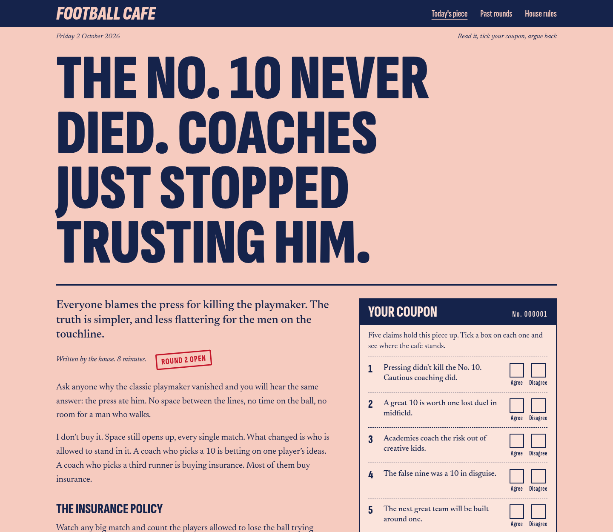

<div align="center">

# ⚽ football-cafe

### Football opinion you can argue with

One writer publishes a piece. Readers tick a coupon on its claims, argue back as guests,
and the writer answers the crowd's best arguments on the page.

```
docker compose up -d --build
```

<br/>

[](https://www.python.org)
[](https://www.djangoproject.com)
[](https://www.django-rest-framework.org)
[](https://www.postgresql.org)
[](compose.yml)
[](https://docs.anthropic.com)
[](footballcafe/core/tests/)

</div>

---

<div align="center">



</div>

## One command, and the cafe is open

`docker compose up -d --build` starts PostgreSQL and the site, runs the migrations, creates your login
and adds one sample piece. No `.env` needed.

| Where | What |
|---|---|
| http://localhost:8010 | The site |
| http://localhost:8010/counter/ | Your admin. Login `house` / `footballcafe` |
| http://localhost:8010/api/swagger/ | The API, documented |

## A coupon instead of a like button

Every piece stands on a few claims. Readers tick agree or disagree on each one, pools-coupon style,
and only then see how the cafe split. A full coupon earns a verdict:

```
You are with the house on 3 of 5. The cafe is most divided on claim 2: 48% agree.
```

No account needed. A reader is one random number in a cookie.

## Two agents doing the boring work

**The moderator** reads every guest reply before it goes up and answers publish, reject (the reader is
told why) or unsure (it waits in your queue). If Claude can't be reached, nothing is published
automatically.

**The note-taker** turns the published replies into at most four arguments, each linked to the real
replies behind it. You answer them, and your answers show on the piece as round 2.

```
docker compose exec footballcafe python manage.py take_notes the-no-10-never-died
```

The same thing is one click in the admin: select a piece, choose "Ask the note-taker to sum up the replies".

## Writing a piece takes one screen

In the admin the piece form shows your Markdown on the left and the piece as readers will see it on the
right, live. The claims and the readers' arguments sit under it, so you write, set the coupon and answer
back without leaving the page. A piece with no publish date is a draft: "View on site" shows it to you
and to nobody else.

## The API

Everything the page does goes through a small DRF API, so another frontend can use it too.

| Method | Path | What |
|---|---|---|
| GET | `/api/pieces/` | Published pieces, newest first |
| GET | `/api/pieces/<slug>/` | One piece with its coupon and arguments |
| POST | `/api/pieces/<slug>/claims/<position>/vote/` | Tick agree (1) or disagree (2) |
| GET | `/api/pieces/<slug>/replies/` | Published replies, `?argument=<id>` to narrow |
| POST | `/api/pieces/<slug>/replies/` | Post a reply as a guest |

## Usage

```
docker compose up -d --build                                    # start
docker compose logs -f footballcafe                             # watch it
docker compose exec footballcafe python manage.py test core     # run the tests
docker compose down                                             # stop (add -v to wipe the database)
```

For real secrets instead of the defaults, let the script write your `.env`:

```
python3 scripts/make_env.py                                  # your own machine
python3 scripts/make_env.py --ip 203.0.113.7 --port 30082    # a server reached by IP, plain http
python3 scripts/make_env.py --domain cafe.example.com        # a server behind an https address
```

It makes a random Django secret key, database password and admin password, and prints the admin login
once. Then put your `ANTHROPIC_API_KEY` in the file and start again.

Already have a database you want to keep? `sh scripts/apply_env.sh` sets its password and the admin login
to what the new `.env` says, without wiping anything.

Both agents run on `claude-haiku-4-5`, the cheapest and fastest Claude model. Measured on the sample
piece: about $1.20 per 1000 replies moderated, and about 2 cents for the note-taker to sum up 200 replies.
`CAFE_MODERATOR_MODEL` and `CAFE_NOTETAKER_MODEL` in `.env` change the model for either one.

Requires Docker. An Anthropic API key is optional: without it every reply waits in your queue.

## Putting it on a server

On the server, in a fresh clone of the repo:

```
python3 scripts/make_env.py --ip <server ip>     # writes .env, prints your admin login
nano .env                                        # paste your ANTHROPIC_API_KEY
docker compose up -d --build
```

The script finds a public port nobody else on the server is using and tells you the address. It also
makes `docker compose` use `compose-deployment.yml` in that folder: gunicorn, debug off, restarts by
itself. To update later: `git pull`, then `docker compose up -d --build` again. The database lives in a
Docker volume and survives updates.

### With your own domain

Point the domain at the server first: at your registrar, add two `A` records, `@` and `www`, both with
the server's IP. Then, on the server:

```
python3 scripts/make_env.py --domain footballcafe.gr --force
docker compose up -d --build
```

`--force` keeps your passwords and keys, so the database carries on as it was. What happens next depends
on the server, and the script tells you which:

- **Ports 80 and 443 are free:** a Caddy container starts in front of the site, gets the https
  certificate by itself and renews it. Nothing else to do.
- **Something already answers there** (Nginx Proxy Manager, for example): the cafe leaves those ports
  alone, and the script prints the three values to enter in that program.

## Status

Version 1. Accounts, share cards, translations and interactive charts are next.

## Notes

- `compose.yml` is the local setup: Django's own server, debug on, a default login. On a server use `compose-deployment.yml`.
- Fonts are Newsreader and Sofia Sans Extra Condensed (SIL Open Font License), served from this site.
- `design/looks-mockup.html` holds the three looks this design was picked from.

## Contributing

Arguments welcome, pull requests too.

```
docker compose up -d --build
docker compose exec footballcafe python manage.py test core
```

<div align="center">

**If the cafe made you argue with a stranger about a No. 10, it did its job.**

</div>
